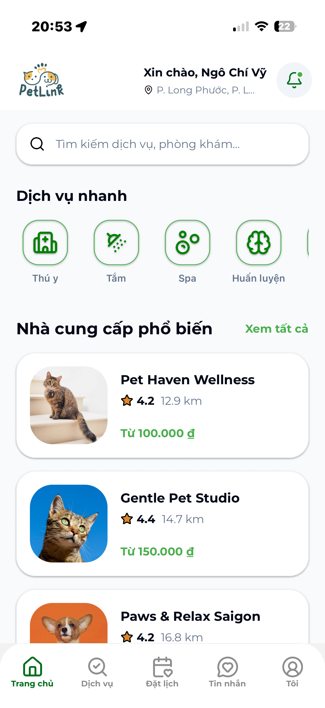
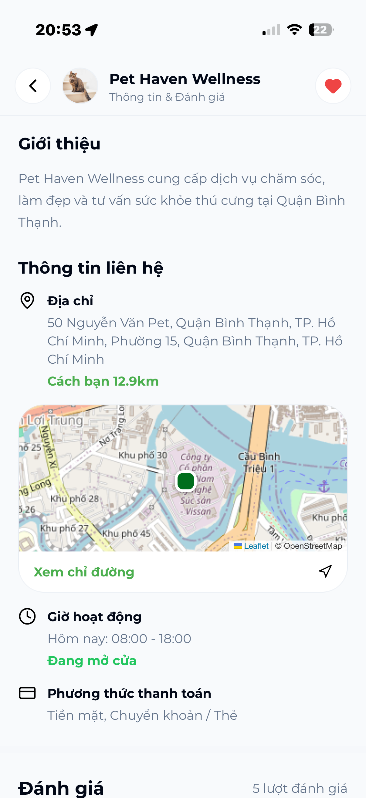
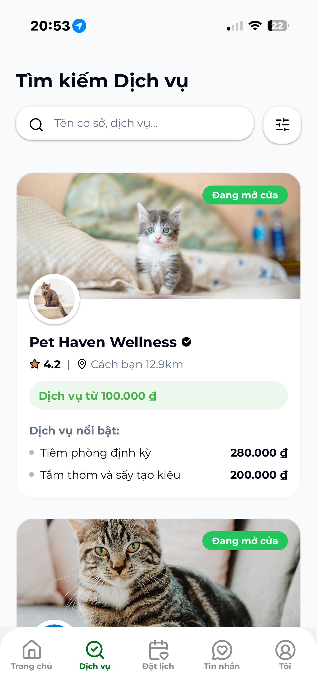
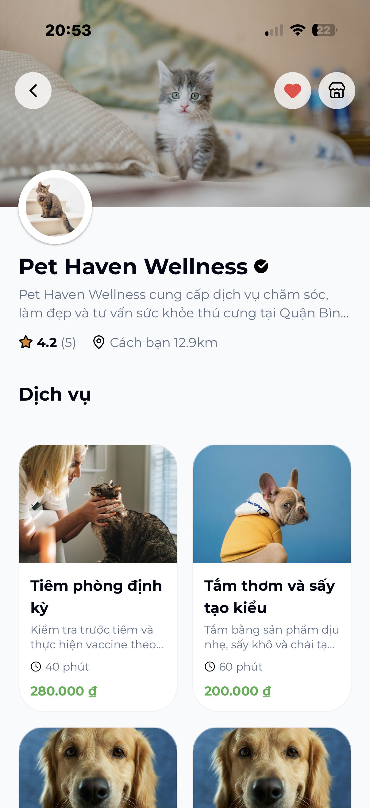

<div align="center">
  <h1 align="center">PetLink Mobile</h1>
  <p align="center">
    <strong>A comprehensive pet care, management, and community platform</strong>
  </p>
</div>

<br />

## About the Project

**PetLink Mobile** is a mobile application built with React Native and Expo, aimed at connecting the pet-loving community. The application provides a comprehensive solution to help users easily manage, care for, and find the best services for their pets. The UI/UX is designed to be modern, smooth, and optimized to meet professional commercial standards.

## Key Features

- **Pet Management:** Track profiles, health status, and medical history of your pets.
- **Community Connection:** Interact and share pet care experiences with other animal lovers.
- **Location-based Services:** Integrated map and geolocation to find the nearest veterinary clinics, spas, and pet food stores (powered by Expo Location).
- **Real-time Chat:** Smooth messaging system (integrated with Socket.io) for instant user interaction.
- **QR Code Scanning:** Integrated React Native QRCode SVG to quickly share information or identify pet profiles.

## Tech Stack

The project is built using modern technologies and libraries, meeting the standards of a high-quality mobile application:

- **Core Framework:** React Native / [Expo](https://expo.dev/) (SDK 54)
- **Language:** TypeScript (ensuring type safety and maintainability)
- **UI / Styling:** [NativeWind](https://www.nativewind.dev/) (TailwindCSS for React Native), Lucide Icons
- **State Management:** [Zustand](https://github.com/pmndrs/zustand)
- **Data Fetching & Caching:** [TanStack React Query](https://tanstack.com/query/latest) v5 & Axios
- **Navigation:** Expo Router (File-based routing) & React Navigation
- **Real-time Communication:** Socket.io-client
- **Data Validation:** Zod

## Screenshots

Below are some actual screenshots of the application. The interface is meticulously crafted to provide the best user experience:

|                                 Screen 1                                  |                                 Screen 2                                  |                                 Screen 3                                  |                                 Screen 4                                  |
| :-----------------------------------------------------------------------: | :-----------------------------------------------------------------------: | :-----------------------------------------------------------------------: | :-----------------------------------------------------------------------: |
|  |  |  |  |

_(Note: Please ensure you have placed the downloaded screenshots into the `assets/screenshots/` directory for them to display correctly)._

## Installation & Setup

### 1. Prerequisites

- Node.js (latest recommended version)
- NPM or Yarn
- A mobile device with the [Expo Go](https://expo.dev/go) app installed, or a configured Android Emulator / iOS Simulator.

### 2. Install Dependencies

Clone the repository and install the required packages:

```bash
git clone <your-repo-url>
cd PetLink_Mobile
npm install
```

### 3. Run the Application

```bash
npx expo start
```

After running the command above, open the **Expo Go** app on your phone and scan the QR code displayed in the terminal to experience the app immediately, or press `a` / `i` to open it on an Emulator/Simulator.

## Contributing

Contributions, issues, and feature requests are welcome. Please open an issue to discuss major changes before submitting a pull request to ensure consistency across the project.

## License

This project is licensed under the MIT License.

---

<p align="center">
  <i>PetLink Mobile - Bringing love closer to your pets.</i>
</p>
